# Cloud Infrastructure and Virtualisation CA

## Overview

This document provides a comprehensive guide to Docker in virtual environments. In this document, I will create a virtual machine (VM) on Microsoft Azure and install Docker on it. It covers containerisation fundamentals, practical Docker workflows, and Docker Compose for multi-container orchestration. By the end, you'll understand how to containerise applications, manage Docker images and containers, and deploy multi-service applications using Docker Compose.

## What is Docker?

Docker is a container platform used to build, ship, and run applications in isolated environments called containers.

- **Container:** A lightweight package that includes your app + its dependencies.
- **Image**: A read-only template used to create containers.
- **Why use it:** It makes apps run consistently across different machines (developer laptop, test server, cloud VM).
In short, Docker helps avoid “works on my machine” issues by standardizing runtime environments.

## Getting Started

1. Setup an account on Microsof Azure
2. Create a Virtual Machine that has Ubuntu
3. Start your Virtual Machine

## Installing Docker Engine on your Ubuntu Virtual Machine

Before installing Docker Engine, first add and configure Docker's official APT repository.

To do this, run the following commands in your VM terminal, as shown in the image below:

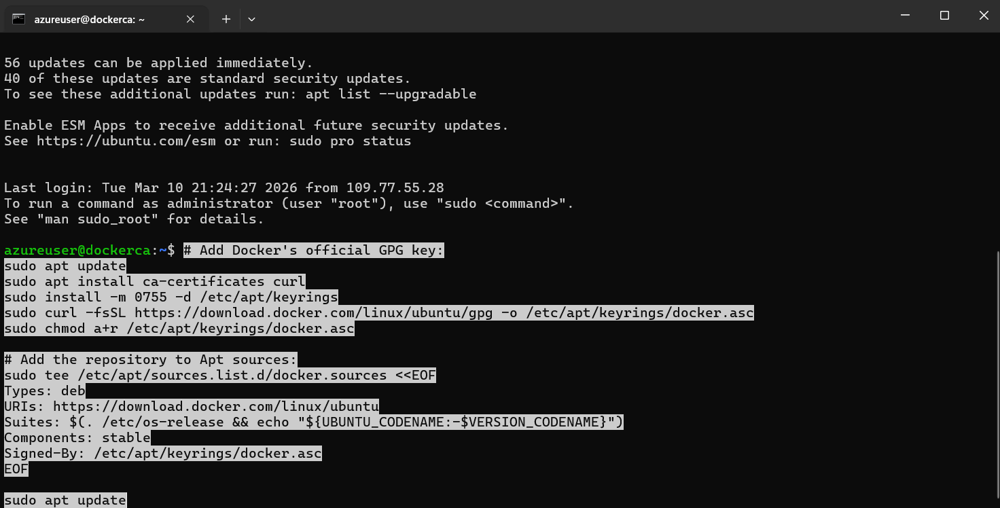

Once you have installed the APT repository, run the following command to install the Docker packages:

```bash
sudo apt install docker-ce docker-ce-cli containerd.io docker-buildx-plugin docker-compose-plugin
```

Finally, after installing the packages, run the following command to start the hello-world image:

```bash
sudo docker run hello-world
```

 If the image below is shown, everything was installed correctly:

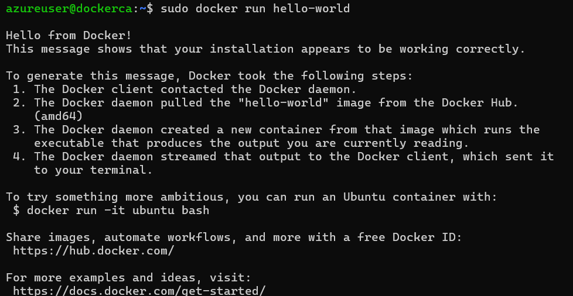

## 1. Containerise an Application

Before you can run the application, you need to have the project source code on your virtual machine. Fork the repository from the Docker getting-started tutorial source code:

[https://github.com/docker/getting-started-app](https://github.com/docker/getting-started-app)

Once the source code is available in your GitHub repository, clone it to your virtual machine, as shown in the image below:

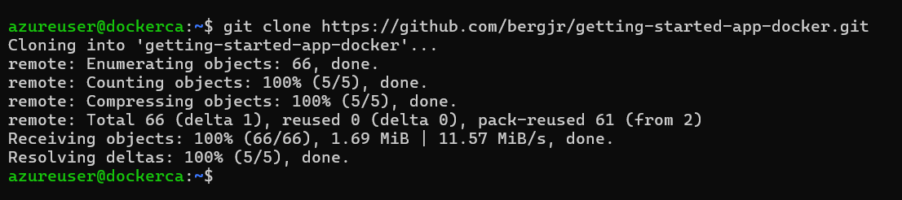

## Building the App Image

To build the image, you need a Dockerfile. A Dockerfile is an extensionless file that contains a set of instructions Docker uses to build an image. 

```bash
FROM node:24-alpine
WORKDIR /app
COPY . .
RUN npm install --omit=dev
CMD ["node", "src/index.js"]
EXPOSE 3000
```

The Dockerfile should be saved in the root directory of your application, and it must be named Dockerfile with no file extension.

After that, inside your application folder, build the image by using the following command:

```bash
docker build -t getting-started .
```

The image bellow shows the image being created in the virtual machine: 

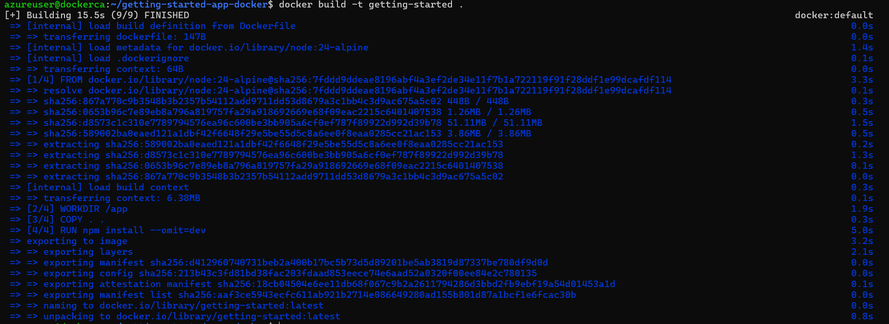

After building the image, you can verify that it was created successfully by running the following command:

```bash
docker image ls
```

## Start App Container

Now that the image has been created, you can use the following command to run the application in a container:

```bash
docker run -d -p 127.0.0.1:3000:3000 getting-started
```

If your application is running, it should appear in the list of running containers when you run `docker ps`, as shown in the image below:

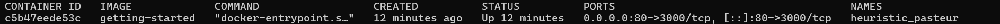

## 2. Update the Application

In this section, you will learn how to update the application and image.

On the **line 56** of the file ```src/static/js/app.js``` located in your github getting-started repo, make the following change:

 ```<p className="text-center">You have no todo items yet! Add one above!</p>```

## Stopping and Removing a Container

Once you have updated the code, **stop and remove** the old container so you can rebuild the image with your changes.

To do it, run the following command:

```bash
docker rm -f $ID_CONTAINER
```

Now, you just need to rebuild your image using ```docker build``` and run the container again to see that the change was made, as it shows the image bellow:

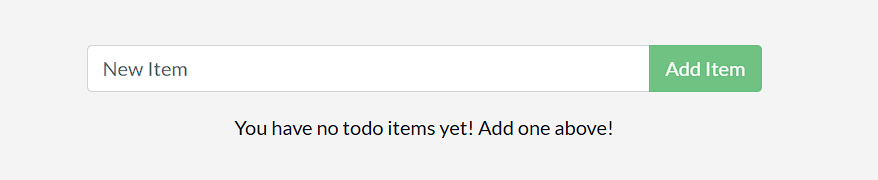

## 3. Share the Application

To share your application, follow the steps below:

1. Have an account on Docker Hub.
2. Select the **Create Repository** button.
3. Give **getting-started** as the name of the repo and **leave the visibility as Public**, as in the image below:

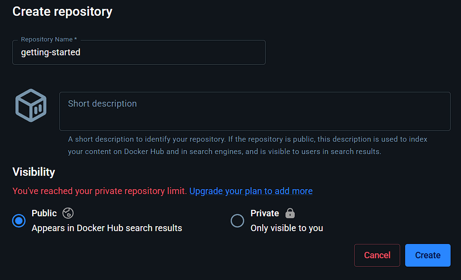

## Push the image

In order to push the image to Docker Hub follow the steps below:

1. Login to your Docker Hub by using the command ```docker login -u $YOUR_USERNAME```, as in the image below:

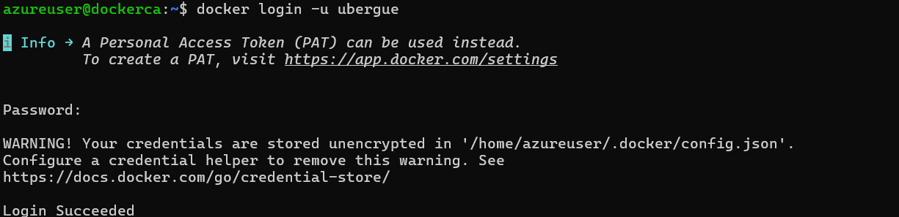

2. Run the `docker tag` command to assign a new name to the `getting-started` image, replacing `YOUR-USER-NAME` with your Docker Hub username:

```bash
docker tag getting-started YOUR-USER-NAME/getting-started
```

3. Finally, run `docker push YOUR-USER-NAME/getting-started` to push the image to your Docker Hub repository, as it shows in the image bellow

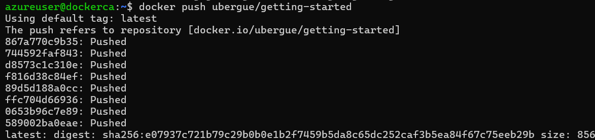

# 4.Persist the DB

In this section you will learn how to persist data between container launches.

## Container's filesystem

When a container starts, it uses the image layers as its filesystem. Each container also has its own temporary writable layer, where files can be created, modified, or deleted. These changes are isolated to that container and are not visible to other containers, even if they were created from the same image.

## Container volumes

Although containers can create, modify, and delete files, those changes are lost when the container is removed, since Docker keeps them isolated within that container. Volumes solve this problem by allowing data to persist independently of the container.

## Create a volume and start the container

1. You can create a volume using the following command
```bash
docker volume create todo-db
```

In the image below you can see that the volume has been created successfully:

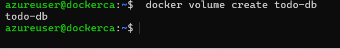

2. Now that you have created the volume, you need to stop and remove the todo container since is still running without our persistent volume. Do it by using the following command:

 ```bash
 docker rm -f $ID_CONTAINER
 ```

3. Start the container again, this time using the ```--mount``` option to attach a named volume and mount it to ```/etc/todos``` inside the container.

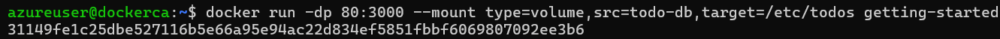

When you open the application, your data will still be there, confirming that the volume is successfully persisting data across container restarts.

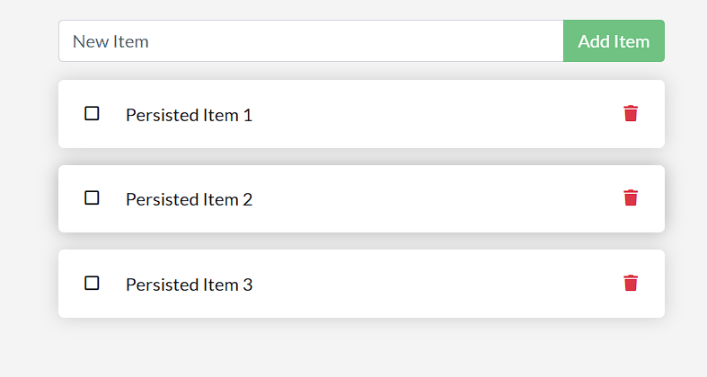

## 5. Use bind mounts

A bind mount is another type of mount that lets you share a directory from the host machine's filesystem with a container. When using a bind mount, the container sees changes made on the host, and the host also sees changes made inside the container.

## Testing out bind mounts

1. Go to the terminal and access your application directory (getting-started-app)

2. Run the following command to start a ```bash``` in an container with a bind mount.

```bash
docker run -it --mount type=bind,src=.,target=/src ubuntu bash
```

The ```--mount type=bind``` option tells Docker to use a bind mount: ```src``` is the current directory on your host machine (```getting-started-app```), and ```target``` is the location where that directory is mounted inside the container (```/src```).

3. The ```/src``` directory inside the container maps to your project folder and contains your application source code, as the image below shows: 

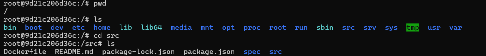

4. Create a new file called myfile.text inside the ```src``` folder by running the following command:

```bash
root@ac1237fad8db:/src# touch myfile.txt
root@ac1237fad8db:/src# ls
Dockerfile  myfile.txt  node_modules  package.json  package-lock.json  spec  src  
```

Creating this file inside the container also creates the same file on the host machine, as shown in the image below:

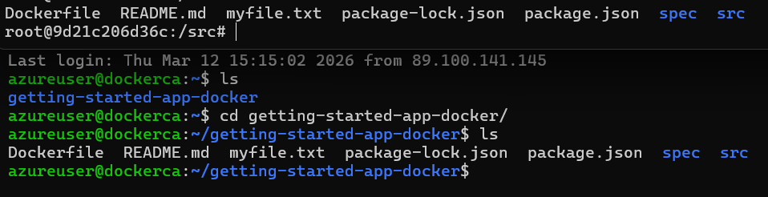

When you perform an action on the host machine, the same change is immediately reflected inside the container. The image below shows this behavior after deleting the file ```myfile.txt```.

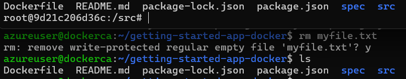

## Development containers

Bind mounts are widely used in local development because they simplify setup. You don’t need to install every build tool or runtime on your host machine. One ```docker run``` command provides the required dependencies and tooling inside the container.

## Running your application in a development container

The steps below show how to run your application in a development container that does the following:
- Uses a bind mount to share your source code with the container.
- Installs development dependencies.
- Starts ``nodemon`` to automatically restart the server when you make changes to your code.

1. First, stop and remove the running container by using the following command:

```bash
docker rm -f $ID_CONTAINER
``` 
2. Now, run the following command to start a development container:

```bash
docker run -dp 127.0.0.1:3000:3000 \
    -w /app --mount type=bind,src=.,target=/app \
    node:24-alpine \
    sh -c "npm install && npm run dev"
```

As it shows in the image below, this command starts a container that uses the Node.js image, mounts your application code into the container, installs dependencies, and starts the development server with nodemon:

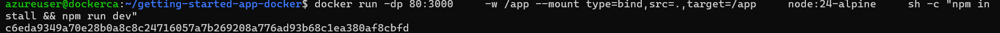

3. Change the text in the file ```src/static/js/app.js``` in the line 109 "Add Item" to "Add". You will see that the change is reflected in the application running inside the container without needing to rebuild the image or restart the container, as shown in the image below:

- Image of code change:


- Image of change reflected in the application: 
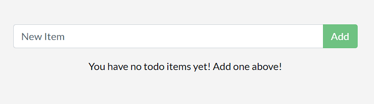
